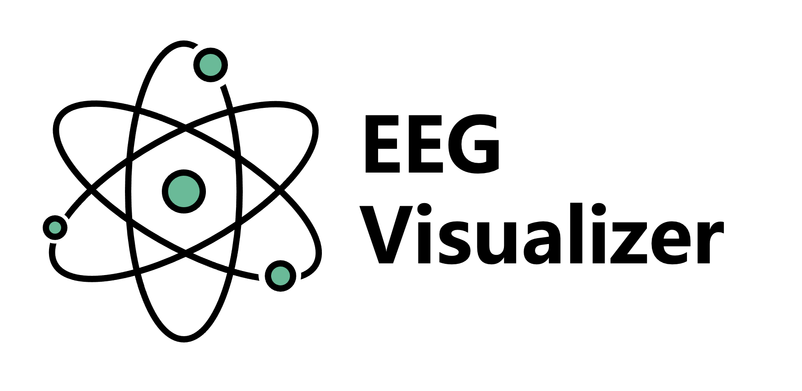

# EEG-Visualizer

  	

  

A EEG visualizer implemented by [Bokeh server](https://docs.bokeh.org/en/latest/docs/user_guide/server.html)

## Demo data

Demo data in the **EEG Visualizer** comes from the SEEG data for the results in "[BrainQuake](https://github.com/HongLabTHU/BrainQuake): an open-source Python toolbox for Stereo-EEG analysis“.

https://zenodo.org/record/5675459#.YySZ3uzMK3Y

